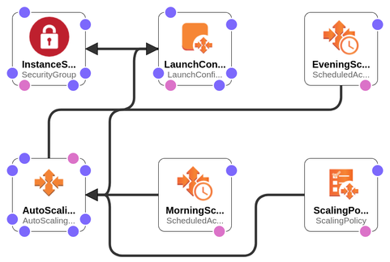

# AWS EC2 Autoscaling Sample

This AWS Cloudformation template defines basic autoscaling policy
with evening and morning scheduled actions. This template can be used as a
basis point for simple cost efficient development environment which starts
in the morning and scales in to zero in the evening.

# Launch the stack

